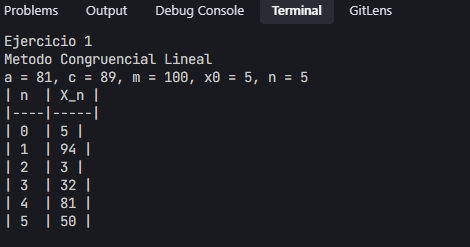
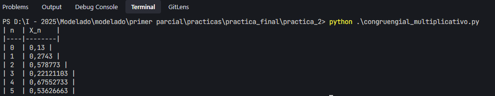
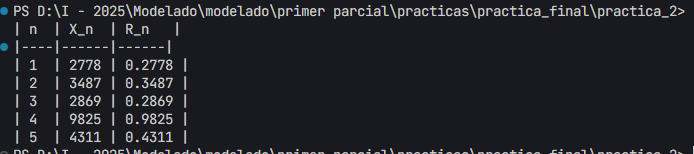
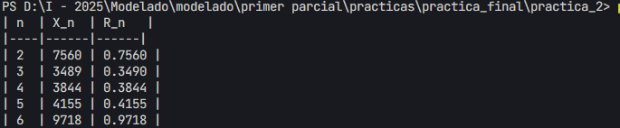

# Práctica 2
> Sergio Guachalla
## Método congruencial linear
### Ejercicio 1: Se pide generar números aleatorios
Datos:
$$ c = 89; x_0 = 5; m = 10^2; a= 81 $$

*La formula para el método congruencial linear es:*
$$ x_{i+1} = (ax_i + c) \mod m $$

Para n números aleatorios:
|n|$X_n$|
|--|----|
|0|5|
|1|$(81×5+89)mod100=94$|
|2|$(81×94+89)mod100=3$|
|3|$(81×3+89)mod100=32$|
|4|$(81×32+89)mod100=81$|
|5|$(81×81+89)mod100=50$|
### Resultado del script:

> *Corresponde al script congruencial_linear.py

## Método congruencial multiplicativo

### Ejercicio 1: 
Datos:
$$ c = 16; x_0 = 13; m = 10^8; a= 211 $$

$X_{n+1} = (8x_n +16) mod 10^8; x_0 = 13$
|1n|$X_n$|
|--|-----|
|0|13|
|1|$(211×13×16)mod10^8=0,13$|
|2|$(211×13×16)mod10^8=0,438$|
|3|$(211×43×16)mod10^8=0,48$|
|4|$(211×48×16)mod10^8=0,80$|
|5|$(211×80×16)mod10^8=0.35$|
### Resultado del script:

> *Corresponde al script congruencial_multiplicativo.py

## Algoritmo de cuadrados medios
Datos iniciales:
- Semilla: $X_0 = 9803$
- Constante: $a = 6965$
- Dígitos a considerar: $D = 4$
- Cantidad de números a generar: 5

## Cálculo de los números:

#### Paso 1:
$$
Y_0 = a \times X_0 = 6965 \times 9803 = 68261895
$$
Tomamos los 4 dígitos centrales: **2778**  
Por lo tanto, \( X_1 = 2778 \) y \( R_1 = 0.2778 \).

---

#### Paso 2:
$$
Y_1 = a \times X_1 = 6965 \times 2778 = 19345170
$$
Tomamos los 4 dígitos centrales: **3487**  
Por lo tanto, \( X_2 = 3487 \) y \( R_2 = 0.3487 \).

---

#### Paso 3:
$$
Y_2 = a \times X_2 = 6965 \times 3487 = 24299155
$$
Tomamos los 4 dígitos centrales: **2869**  
Por lo tanto, \( X_3 = 2869 \) y \( R_3 = 0.2869 \).

---

#### Paso 4:
$$
Y_3 = a \times X_3 = 6965 \times 2869 = 19979185
$$
Tomamos los 4 dígitos centrales: **9825**  
Por lo tanto, \( X_4 = 9825 \) y \( R_4 = 0.9825 \).

---

#### Paso 5:
$$
Y_4 = a \times X_4 = 6965 \times 9825 = 68438625
$$
Tomamos los 4 dígitos centrales: **4311**  
Por lo tanto, \( X_5 = 4311 \) y \( R_5 = 0.4311 \).

---

### Resultado Final:
Los 5 números generados son:

$$
R_1 = 0.2778, \quad R_2 = 0.3487, \quad R_3 = 0.2869, \quad R_4 = 0.9825, \quad R_5 = 0.4311
$$

### Resultado del script:

> *Corresponde al script cuadrados_medios.py

## Algoritmo de Productos Medios

## Datos Iniciales:
- **Semilla inicial:** 𝑋₀ = 5015  
- **Segundo valor:** 𝑋₁ = 5734  
- **Dígitos a considerar:** 𝐷 = 4  

## Cálculo de los números:
1. Multiplicamos 𝑋ₙ y 𝑋ₙ₊₁ para obtener un número largo.
2. Extraemos los **4 dígitos centrales** del producto.
3. El número generado 𝑋ₙ₊₂ será ese valor de 4 dígitos.

---

## Cálculo paso a paso:

### Paso 1:
Multiplicamos 𝑋₀ y 𝑋₁:
- 𝑌₀ = 5015 × 5734 = **28723710**
- Tomamos los 4 dígitos centrales: **7560**
- Por lo tanto:
  - 𝑋₂ = 7560  
  - 𝑅₂ = 0.7560

---

### Paso 2:
Multiplicamos 𝑋₁ y 𝑋₂:
- 𝑌₁ = 5734 × 7560 = **43305040**
- Tomamos los 4 dígitos centrales: **3489**
- Por lo tanto:
  - 𝑋₃ = 3489  
  - 𝑅₃ = 0.3490

---

### Paso 3:
Multiplicamos 𝑋₂ y 𝑋₃:
- 𝑌₂ = 7560 × 3489 = **26334840**
- Tomamos los 4 dígitos centrales: **3844**
- Por lo tanto:
  - 𝑋₄ = 3844  
  - 𝑅₄ = 0.3844

---

### Paso 4:
Multiplicamos 𝑋₃ y 𝑋₄:
- 𝑌₃ = 3489 × 3844 = **13402056**
- Tomamos los 4 dígitos centrales: **4155**
- Por lo tanto:
  - 𝑋₅ = 4155  
  - 𝑅₅ = 0.4155

---

### Paso 5:
Multiplicamos 𝑋₄ y 𝑋₅:
- 𝑌₄ = 3844 × 4155 = **15992420**
- Tomamos los 4 dígitos centrales: **9718**
- Por lo tanto:
  - 𝑋₆ = 9718  
  - 𝑅₆ = 0.9718

---

## Resultado Final:
Los **5 números generados** son:

- 𝑅₂ = 0.7560  
- 𝑅₃ = 0.3490  
- 𝑅₄ = 0.3844  
- 𝑅₅ = 0.4155  
- 𝑅₆ = 0.9718
### Resultado del script:

> *Corresponde al script productos_medios.py
