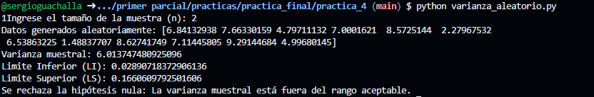
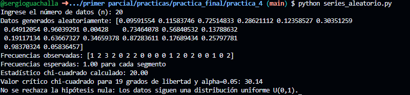
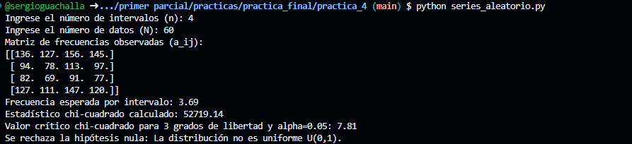

# Práctica 4
> Sergio Guachalla

## Prueba de la varianza (Clase)

### Resultado del script

## Prueba de la varianza (Aleatorio)

### Resultado del script:

>*Corresponde al script varianza_aleatorio

## Prueba de frecuencias (Clase)
### Resultado del script:

## Prueba de frecuencias (Aleatorio)
### Resultado del script:

## Prueba de series (Clase)
### Resultado del script:

## Prueba de series (Aleatorio)
### Resultado del script:

