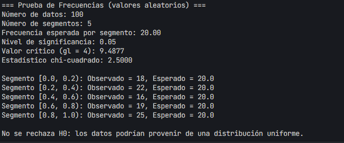
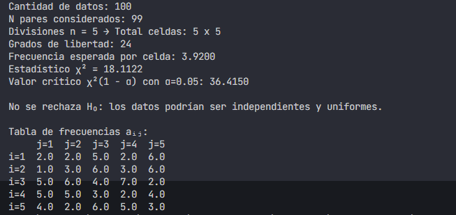
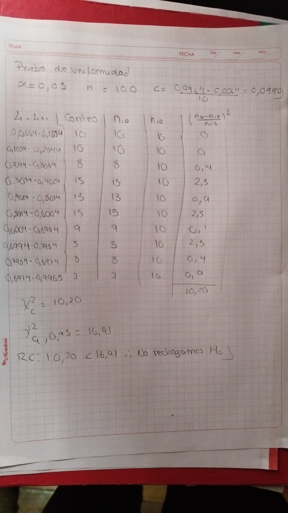
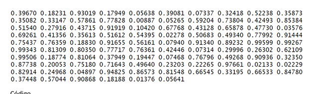

# Práctica 4
> Sergio Guachalla

## Prueba de la varianza (Clase)
### Datos clase:

### Resolución:

### Resultado del script

## Prueba de la varianza (Aleatorio)

### Resultado del script:

>*Corresponde al script varianza_aleatorio

## Prueba de frecuencias (Clase)
### Datos Clase:

### Resolución:

### Resultado del script:

> [corresponde al script frecuencias_clase.py ](scripts/frecuencias.py)

## Prueba de frecuencias (Aleatorio)
### Resultado del script:

## Prueba de series (Clase)
## Datos Clase:

## Resolucion:

### Resultado del script:

> [corresponde al script series_clase.py ](scripts/series_clase.py)
## Prueba de series (Aleatorio)
### Resultado del script:

## Prueba de promedios (Clases)
### Datos:

### Resolución:

### Resultado del script

## Prueba de promedios (Aleatorio)
### Resultado del script

## Prueba de kolmogorov (Clase)
### Datos Clase:

### Resultado:

### Resultado del script:

> [corresponde al script kolmogorov_clase.py ](scripts/kolmogorov_clase.py)

## Prueba de uniformidad (Clase)
### Datos Clase:

### Resolución:

### Resultado del script:

> [corresponde al script uniformidad_clase.py ](scripts/uniformidad_clase.py)

## Prueba de uniformidad (Aleatorio)
### Resultado del script:

> [corresponde al script uniformidad_aleatorio.py ](scripts/uniformidad_aleatorio.py)

## Prueba de corridas arriba y abajo (Clase)
### Datos Clase:

### Resolución:

### Resultado del script:

> [corresponde al script corridas_clase_arriba.py ](scripts/corridas_clase_arriba.py)

## Prueba de corridas arriba y abajo (Aleatorio)
### Resultado del script:

> [corresponde al script corridas_aleatorio_arriba.py ](scripts/corridas_aleatorio_arriba.py)

## Prueba de corridas media (Clase)
### Datos Clase:

### Resolución:

### Resultado del script:

> [corresponde al script corridas_clase_media.py ](scripts/corridas_media_clase.py)

## Prueba de corridas media (Aleatorio)
### Resultado del script:

## Prueba de poker (Clase)
### Datos Clase:

### Resolución:

### Resultado del script:

## Prueba de poker (Aleatorio)
### Resultado del script:

> [corresponde al script poker_aleatorio.py ](scripts/poker_aleatorio.py)

## Prueba de huecos (Clase)
### Datos:

### Resolucion

### Resultado del script:

## Prueba de huecos (aleatorio)
### Resultado del script:

