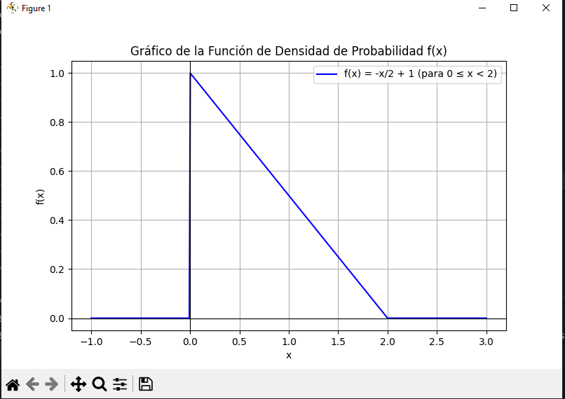
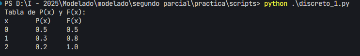
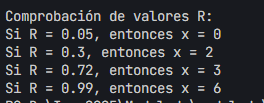

## Practica 4
> **Sergio Guachalla Chavez**
## Casos continuos
### Ejercicio 1
**Hallar los generadores de números aleatorios:**
$$
F(x)=
\begin{cases}
0; x<0 \\
\frac{x^2}{2} \space{} ; 0<= x <1 \\
\frac{x}{2}; 1<= x < 2 \\ 
1; x>=2
\end{cases}
$$

#### Solución en clases:


#### Solución Script:
Script:
```python
import numpy as np
import matplotlib.pyplot as plt

# Paso 1: Método de aceptación y rechazo
np.random.seed(42)
samples = []
n_samples = 200

while len(samples) < n_samples:
    x = np.random.uniform(0, 2)
    y = np.random.uniform(0, 1)

    # Definimos f(x)
    if 0 <= x < 1:
        fx = x
    elif 1 <= x < 2:
        fx = 0.5
    else:
        fx = 0

    if y <= fx:
        samples.append(x)

samples = np.array(samples)

# Paso 2: Definir f(x) y F(x)
x_vals = np.linspace(0, 2.5, 500)
f_vals = np.piecewise(x_vals,
                      [(x_vals >= 0) & (x_vals < 1),
                       (x_vals >= 1) & (x_vals < 2)],
                      [lambda x: x, lambda x: np.full_like(x, 0.5), 0])

F_vals = np.piecewise(x_vals,
                      [x_vals < 0,
                       (x_vals >= 0) & (x_vals < 1),
                       (x_vals >= 1) & (x_vals < 2),
                       x_vals >= 2],
                      [0,
                       lambda x: (x**2)/2,
                       lambda x: x/2,
                       1])


# Paso 3: Graficar
plt.figure(figsize=(10, 6))

# Histograma normalizado
plt.hist(samples, bins=20, density=True, alpha=0.6,
         label="Datos generados", edgecolor='black')

# f(x)
plt.plot(x_vals, f_vals, 'b-', lw=2, label='f(x)')

# F(x)
plt.plot(x_vals, F_vals, 'g--', lw=2, label='F(x)')

# Texto con los generadores en la parte izquierda del gráfico
plt.text(0.05, 0.95,
         r"$x = \sqrt{2R},\ R \in [0,\ 0.5]$" + "\n" + r"$x = 2R,\ R \in [0.5,\ 1]$",
         transform=plt.gca().transAxes,
         fontsize=11, verticalalignment='top',
         bbox=dict(boxstyle="round", facecolor="white", alpha=0.8))

# Estética
plt.title("Muestras generadas bajo f(x), con f(x) y F(x)")
plt.xlabel("x")
plt.ylabel("Densidad / Probabilidad acumulada")
plt.legend()
plt.grid(True)
plt.tight_layout()
plt.show()
```
### Resultado:


### Ejercicio 2
#### Solución en clases:


#### Solución Script:
Script:
```python
import numpy as np
import matplotlib.pyplot as plt
import sympy as sp
# Paso 1: Definir y graficar f(x)
x_vals = np.linspace(-1, 3, 400)
f_vals = np.piecewise(x_vals,
                      [x_vals < 0,
                       (x_vals >= 0) & (x_vals < 2),
                       x_vals >= 2],
                      [0,
                       lambda x: -x/2 + 1,
                       0])

plt.figure(figsize=(8, 5))
plt.plot(x_vals, f_vals, label='f(x) = -x/2 + 1 (para 0 ≤ x < 2)', color='blue')
plt.title("Gráfico de la Función de Densidad de Probabilidad f(x)")
plt.xlabel("x")
plt.ylabel("f(x)")
plt.grid(True)
plt.axhline(0, color='black', linewidth=0.8)
plt.axvline(0, color='black', linewidth=0.8)
plt.legend()
plt.show()

# Paso 2: Verificar que es una FDP (área bajo la curva = 1)
x = sp.Symbol('x', real=True)
f_expr = -x/2 + 1
integral = sp.integrate(f_expr, (x, 0, 2))
print("Integral de f(x) de 0 a 2:", integral)  # Debe imprimir 1

# Paso 3: Construir y graficar F(x)
F_expr = -x**2/4 + x
F_lambdified = sp.lambdify(x, F_expr, 'numpy')

x_vals_fx = np.linspace(-1, 3, 400)
F_vals = np.piecewise(x_vals_fx,
                      [x_vals_fx < 0,
                       (x_vals_fx >= 0) & (x_vals_fx < 2),
                       x_vals_fx >= 2],
                      [0,
                       lambda x: F_lambdified(x),
                       1])

plt.figure(figsize=(8, 5))
plt.plot(x_vals_fx, F_vals, label='F(x) = -x²/4 + x (para 0 ≤ x < 2)', color='green')
plt.title("Gráfico de la Función de Distribución Acumulada F(x)")
plt.xlabel("x")
plt.ylabel("F(x)")
plt.grid(True)
plt.axhline(0, color='black', linewidth=0.8)
plt.axvline(0, color='black', linewidth=0.8)
plt.legend()
plt.show()

# Paso 4: Despejar x en F(x) = u
u = sp.Symbol('u')
inv_eq = sp.solve(sp.Eq(u, F_expr), x)
print("Despeje simbólico de F(x) = u => x(u):", inv_eq)

# Escoger solución válida en [0, 2]
F_inv_expr = inv_eq[0]  # x = 2 - 2*sqrt(1 - u)
F_inv_func = sp.lambdify(u, F_inv_expr, 'numpy')

# Paso 5: Generar números aleatorios a partir de F⁻¹(u) y graficar sobre F(x)
u_vals = np.linspace(0, 1, 100)
x_gen = F_inv_func(u_vals)
F_gen = F_lambdified(x_gen)

plt.figure(figsize=(8, 5))
plt.plot(x_vals_fx, F_vals, label='F(x)', color='lightgray', linewidth=2)
plt.scatter(x_gen, F_gen, label='Puntos generados con inversa F⁻¹(u)', color='purple', alpha=0.7)
plt.title("Verificación: Puntos generados por F⁻¹(u) sobre F(x)")
plt.xlabel("x generado")
plt.ylabel("F(x)")
plt.grid(True)
plt.legend()
plt.show()
```
#### Resultado:



### Ejercicio 3
Hallar el generador de números aleatorios para la siguiente distribución de probabilidad:
$$
f(x) = 
\begin{cases}
0; x<8 \\
\frac{x}{2} - \frac{15}{4} ; 8<=x<9 \\
 - \frac{x}{2} +\frac{21}{4}; 9<= x < 10 \\
1; x>=10
\end{cases}
$$
#### Solución en clases:


#### Solución Script:
Script:
```python
import numpy as np
import matplotlib.pyplot as plt
import sympy as sp

# Paso 1: Definir f(x)
x_vals = np.linspace(7, 11, 400)
f_vals = np.piecewise(x_vals,
                      [x_vals < 8,
                       (x_vals >= 8) & (x_vals < 9),
                       (x_vals >= 9) & (x_vals < 10),
                       x_vals >= 10],
                      [0,
                       lambda x: x/2 - 15/4,
                       lambda x: -x/2 + 21/4,
                       0])

# Graficar f(x)
plt.figure(figsize=(8, 5))
plt.plot(x_vals, f_vals, label=r'$f(x)$ por tramos', color='blue')
plt.title("Función de Densidad de Probabilidad f(x)")
plt.xlabel("x")
plt.ylabel("f(x)")
plt.grid(True)
plt.axhline(0, color='black', linewidth=0.8)
plt.axvline(0, color='black', linewidth=0.8)
plt.legend()
plt.show()

# Paso 2: Verificar que f(x) sea una FDP (área = 1)
x = sp.Symbol('x', real=True)

f1 = x/2 - 15/4
f2 = -x/2 + 21/4

int1 = sp.integrate(f1, (x, 8, 9))
int2 = sp.integrate(f2, (x, 9, 10))
total_area = int1 + int2

print("Área bajo f(x) entre 8 y 10:", total_area)  # Debe ser 1

# Paso 3: Definir y graficar F(x)
F1 = sp.integrate(f1, (x, 8, x))  # entre 8 y x < 9
F2 = int1 + sp.integrate(f2, (x, 9, x))  # entre 9 y x < 10

F_lamb = lambda x_vals: np.piecewise(x_vals,
    [x_vals < 8,
     (x_vals >= 8) & (x_vals < 9),
     (x_vals >= 9) & (x_vals < 10),
     x_vals >= 10],
    [0,
     sp.lambdify(x, F1, 'numpy'),
     sp.lambdify(x, F2, 'numpy'),
     1]
)

x_vals_cdf = np.linspace(7, 11, 400)
F_vals = F_lamb(x_vals_cdf)

plt.figure(figsize=(8, 5))
plt.plot(x_vals_cdf, F_vals, label="F(x): función de distribución acumulada", color='green')
plt.title("Función de Distribución Acumulada F(x)")
plt.xlabel("x")
plt.ylabel("F(x)")
plt.grid(True)
plt.legend()
plt.show()

# Paso 4: Despejar F⁻¹(u) para los dos tramos

u = sp.Symbol('u')

# Primer tramo: F1 = x**2/4 - (15/4)*x + C
F1_expr = sp.integrate(f1, (x, 8, x))  # Usado arriba
inv1 = sp.solve(sp.Eq(u, F1_expr), x)
print("Inversa primer tramo (8 ≤ x < 9):", inv1)

# Segundo tramo: F2 = area1 + ∫f2
F2_expr = int1 + sp.integrate(f2, (x, 9, x))
inv2 = sp.solve(sp.Eq(u, F2_expr), x)
print("Inversa segundo tramo (9 ≤ x < 10):", inv2)

# Paso 5: Generar valores aleatorios por inversa
# Seleccionar funciones válidas por dominio
F1_inv_func = sp.lambdify(u, inv1[0], 'numpy')  # válido para u in [0, 0.5]
F2_inv_func = sp.lambdify(u, inv2[1], 'numpy')  # válido para u in (0.5, 1]

# Unimos ambos en función por tramos
def gen_x_from_u(u_vals):
    return np.piecewise(u_vals,
                        [u_vals <= 0.5, u_vals > 0.5],
                        [F1_inv_func, F2_inv_func])

# Generar u y x
u_vals = np.linspace(0, 1, 300)
x_generated = gen_x_from_u(u_vals)
F_computed = F_lamb(x_generated)

# Graficar scatter de puntos generados sobre F(x)
plt.figure(figsize=(8, 5))
plt.plot(x_vals_cdf, F_vals, label='F(x)', color='lightgray', linewidth=2)
plt.scatter(x_generated, F_computed, label='Puntos generados: inversa F⁻¹(u)', color='purple', alpha=0.7)
plt.title("Verificación: Puntos generados con F⁻¹(u) sobre F(x)")
plt.xlabel("x generado")
plt.ylabel("F(x)")
plt.grid(True)
plt.legend()
plt.show()
```
#### Resultado:


### Ejercicio 4
Hallar el generador de números aleatorios para la siguiente distribución de probabilidad:
$$
f(x) = \begin{cases}
0 ; x<3 \\
\frac{x}{4} + \frac{3}{4}; 3<= x < 5 \\
\frac{1}{2} ; 5<= x <8 \\
-\frac{x}{4} + \frac{5}{2}; 8<= x <10
\end{cases}
$$
#### Solución en clases:


#### Solución Script:
Script:
```python
import numpy as np
import matplotlib.pyplot as plt
import sympy as sp

x_vals = np.linspace(2, 15, 600)
f_vals = np.piecewise(x_vals,
                      [x_vals < 3,
                       (x_vals >= 3) & (x_vals < 5),
                       (x_vals >= 5) & (x_vals < 8),
                       (x_vals >= 8) & (x_vals < 10),
                       x_vals >= 10],
                      [0,
                       lambda x: x/4 + 3/4,
                       1/2,
                       lambda x: -x/4 + 5/2,
                       1])  # intencionalmente incorrecto para ilustrar

# Gráfico de f(x)
plt.figure(figsize=(8, 5))
plt.plot(x_vals, f_vals, label='f(x) (incluye 1 para x ≥ 10)', color='crimson')
plt.title("Función f(x): Incluye tramo constante igual a 1 desde x=10")
plt.xlabel("x")
plt.ylabel("f(x)")
plt.grid(True)
plt.legend()
plt.show()

# ------------------------
# Construcción de F(x)
# ------------------------
x = sp.Symbol('x', real=True)

f1 = x/4 + 3/4     # 3 <= x < 5
f2 = 1/2           # 5 <= x < 8
f3 = -x/4 + 5/2    # 8 <= x < 10

A1 = sp.integrate(f1, (x, 3, 5))
A2 = A1 + sp.integrate(f2, (x, 5, 8))
A3 = A2 + sp.integrate(f3, (x, 8, 10))

F1 = sp.integrate(f1, (x, 3, x))
F2 = A1 + sp.integrate(f2, (x, 5, x))
F3 = A2 + sp.integrate(f3, (x, 8, x))

F_lamb = lambda x_vals: np.piecewise(x_vals,
    [x_vals < 3,
     (x_vals >= 3) & (x_vals < 5),
     (x_vals >= 5) & (x_vals < 8),
     (x_vals >= 8) & (x_vals < 10),
     x_vals >= 10],
    [0,
     sp.lambdify(x, F1, 'numpy'),
     sp.lambdify(x, F2, 'numpy'),
     sp.lambdify(x, F3, 'numpy'),
     float(A3)])  # F(x)=constante después de 10

x_vals_cdf = np.linspace(2, 12, 500)
F_vals = F_lamb(x_vals_cdf)

plt.figure(figsize=(8, 5))
plt.plot(x_vals_cdf, F_vals, label='F(x)', color='green')
plt.title("Función de Distribución Acumulada F(x)")
plt.xlabel("x")
plt.ylabel("F(x)")
plt.grid(True)
plt.legend()
plt.show()

# ------------------------
# Inversas por tramo (respetando rangos)
# ------------------------
u = sp.Symbol('u')
F1_expr = sp.integrate(f1, (x, 3, x))
F2_expr = A1 + sp.integrate(f2, (x, 5, x))
F3_expr = A2 + sp.integrate(f3, (x, 8, x))

inv1 = sp.solve(sp.Eq(u, F1_expr), x)[1]  # elegir la raíz positiva
inv2 = sp.solve(sp.Eq(u, F2_expr), x)[0]
inv3 = sp.solve(sp.Eq(u, F3_expr), x)[0]

# Lambdify inversas
inv1_func = sp.lambdify(u, inv1, 'numpy')
inv2_func = sp.lambdify(u, inv2, 'numpy')
inv3_func = sp.lambdify(u, inv3, 'numpy')

A1_f = float(A1)
A2_f = float(A2)
A3_f = float(A3)

# ------------------------
# Generar puntos con inversa de F
# ------------------------
def gen_x_from_u(u_vals):
    return np.piecewise(u_vals,
                        [u_vals <= A1_f,
                         (u_vals > A1_f) & (u_vals <= A2_f),
                         u_vals > A2_f],
                        [inv1_func, inv2_func, inv3_func])

# Generar u en el dominio correcto
u_vals = np.linspace(0, A3_f, 400)
x_generated = gen_x_from_u(u_vals)
F_computed = F_lamb(x_generated)

# ------------------------
# Gráfico scatter corregido (puntos sobre F(x))
# ------------------------
plt.figure(figsize=(8, 5))
plt.plot(x_vals_cdf, F_vals, label='F(x)', color='lightgray', linewidth=2)
plt.scatter(x_generated, F_computed, label='Puntos generados con F⁻¹(u)', color='purple', alpha=0.7)
plt.title("Verificación: Puntos generados con inversa F⁻¹(u) sobre F(x)")
plt.xlabel("x generado")
plt.ylabel("F(x)")
plt.grid(True)
plt.legend()
plt.show()
```
#### Resultado:


## Casos Discretos
### Ejercicio 5

|$x$|$P(x)$|$F(x)$|
|:-:|:-:|:-:|
|0|0.5|0.5|
|1|0.3|0.8|
|2|0.2|1|
#### Solución en clases:


#### Solución Script:
Script:
```python
import matplotlib.pyplot as plt
import numpy as np

# Paso 1: Definir la distribución de probabilidad discreta
valores_x = [0, 1, 2]
probabilidades = [0.5, 0.3, 0.2]  # P(x)

# Calcular F(x)
F_x = [probabilidades[0]]
for i in range(1, len(probabilidades)):
    F_x.append(F_x[-1] + probabilidades[i])

# Mostrar tabla con P(x) y F(x)
print("Tabla de P(x) y F(x):")
print("x\tP(x)\tF(x)")
for x, p, f in zip(valores_x, probabilidades, F_x):
    print(f"{x}\t{p}\t{f}")

# Paso 2: Graficar F(x)
x_vals_completos = [-1, 0, 1, 2, 3]
F_x_completo = [0, 0.5, 0.8, 1, 1]   # F(x) incluyendo valores extremos

plt.step(x_vals_completos, F_x_completo, where='post', linestyle='--', marker='o')
plt.title('Función de Distribución Acumulada F(x)')
plt.xlabel('x')
plt.ylabel('F(x)')
plt.grid(True)
plt.xticks(valores_x)
plt.yticks([0, 0.5, 0.8, 1])
plt.show()

# Paso 3: Función generadora (inversa de F)
def generar_valor_discreto(R):
    if R <= 0.5:
        return 0
    elif R <= 0.8:
        return 1
    else:
        return 2

# Paso 4: Comprobación con valores dados de R
valores_R = [0.2384, 0.7956, 0.9500]
print("\nComprobación de valores R:")
for R in valores_R:
    x = generar_valor_discreto(R)
    print(f"Si R = {R}, entonces x = {x}")

```



### Ejercicio 6

#### Solución en clases:


#### Solución Script:
Script:
```python
import matplotlib.pyplot as plt
import numpy as np
from math import comb

# Parámetros del experimento binomial
n = 10
p = 1/4
q = 1 - p

# Paso 1: Calcular P(x) y F(x)
valores_x = list(range(n + 1))
P_x = [comb(n, x) * (p ** x) * (q ** (n - x)) for x in valores_x]
F_x = np.cumsum(P_x)

# Paso 2: Imprimir tabla
print("Tabla de P(x) y F(x):")
print("x\tP(x)\t\tF(x)")
for x, p_val, f_val in zip(valores_x, P_x, F_x):
    print(f"{x}\t{p_val:.6f}\t{f_val:.6f}")

# Paso 3: Graficar F(x)
x_graf = [-1] + valores_x + [n+1]
F_graf = [0] + list(F_x) + [1.0]

plt.step(x_graf, F_graf, where='post', linestyle='--', marker='o')
plt.title('Función de Distribución Acumulada F(x) - Binomial(n=10, p=0.25)')
plt.xlabel('x')
plt.ylabel('F(x)')
plt.grid(True)
plt.xticks(valores_x)
plt.yticks(np.round(np.linspace(0, 1, 11), 2))
plt.show()

# Paso 4: Generador inverso
def generar_valor_discreto_binomial(R, F_vals=F_x):
    for i, f in enumerate(F_vals):
        if R < f:
            return i
    return len(F_vals) - 1  # Por si R ≈ 1

# Comprobación de algunos valores R
valores_R = [0.05, 0.3, 0.72, 0.99]
print("\nComprobación de valores R:")
for R in valores_R:
    x = generar_valor_discreto_binomial(R)
    print(f"Si R = {R}, entonces x = {x}")
```




### Ejercicio 7


> Un operador de call centers realiza llamadas hasta conseguir que una persona le conteste.
La probabilidad de que alguien le conteste es de 𝑝=0.3
p=0.3.
Sea 𝑋 X el número de llamadas hasta obtener el primer éxito.
Hallar el generador de números aleatorios.
#### Solución en clases:


#### Solución Script:
Script:
```python
import numpy as np
import matplotlib.pyplot as plt
from math import exp, factorial

# Parámetros de la distribución de Poisson
lambd = 5
x_vals = list(range(16))  # x de 0 a 15

# Paso 1: Calcular P(x) y F(x)
P_x = [(exp(-lambd) * lambd**x) / factorial(x) for x in x_vals]
F_x = np.cumsum(P_x)

# Paso 2: Imprimir tabla
print("Tabla de P(x) y F(x):")
print("x\tP(x)\t\tF(x)")
for x, p, f in zip(x_vals, P_x, F_x):
    print(f"{x}\t{p:.6f}\t{f:.6f}")

# Paso 3: Graficar F(x)
x_graf = [-1] + x_vals + [max(x_vals)+1]
F_graf = [0] + list(F_x) + [1.0]

plt.step(x_graf, F_graf, where='post', linestyle='--', marker='o')
plt.title('Distribución Acumulada F(x) - Poisson(λ=5)')
plt.xlabel('x')
plt.ylabel('F(x)')
plt.grid(True)
plt.xticks(range(0, 16))
plt.yticks(np.round(np.linspace(0, 1, 11), 2))
plt.show()

# Paso 4: Método de la inversa para generar valores
def generar_valor_poisson_inverso(R, F_vals=F_x):
    for i, f in enumerate(F_vals):
        if R < f:
            return i
    return len(F_vals) - 1

# Paso 5: Comprobación de valores R
valores_R = [0.006, 0.25, 0.52, 0.985]
print("\nComprobación de valores R:")
for R in valores_R:
    x = generar_valor_poisson_inverso(R)
    print(f"Si R = {R}, entonces x = {x}")

```


### Ejercicio 8 (Geométrica)
#### Solución en clases:


#### Solución Script:
Script:
```python
import numpy as np
import matplotlib.pyplot as plt

# Parámetro de éxito
p = 0.3
q = 1 - p

# Valores de x: número de intentos hasta el primer éxito
x_vals = list(range(1, 13))

# Paso 1: Calcular P(x) y F(x)
P_x = [(q**(x-1)) * p for x in x_vals]
F_x = np.cumsum(P_x)

# Paso 2: Imprimir tabla
print("Tabla de P(x) y F(x):")
print("x\tP(x)\t\tF(x)")
for x, p_val, f_val in zip(x_vals, P_x, F_x):
    print(f"{x}\t{p_val:.6f}\t{f_val:.6f}")

# Paso 3: Graficar F(x)
x_graf = [0] + x_vals + [x_vals[-1]+1]
F_graf = [0] + list(F_x) + [1.0]

plt.step(x_graf, F_graf, where='post', linestyle='--', marker='o')
plt.title('Función de Distribución Acumulada F(x) - Geométrica (p = 0.3)')
plt.xlabel('x (número de llamadas)')
plt.ylabel('F(x)')
plt.grid(True)
plt.xticks(range(1, 13))
plt.yticks(np.round(np.linspace(0, 1, 11), 2))
plt.show()

# Paso 4: Generador por el método de la inversa
def generar_geom_inversa(R, F_vals=F_x):
    for i, f in enumerate(F_vals):
        if R < f:
            return i + 1  # porque x comienza en 1
    return len(F_vals)  # en caso R ≈ 1

# Paso 5: Comprobación de valores R
valores_R = [0.2, 0.51, 0.7599, 0.85]
print("\nComprobación de valores R:")
for R in valores_R:
    x = generar_geom_inversa(R)
    print(f"Si R = {R}, entonces x = {x}")

```


### Ejercicio 9 (Hipergeométrica)
#### Solución en clases:


#### Solución Script:
Script:
```python
import matplotlib.pyplot as plt
import numpy as np
from math import comb

# Parámetros
N = 25  # población total
K = 10  # número de éxitos (bolas rojas)
n = 5   # tamaño de muestra

# Paso 1: calcular P(x) y F(x)
x_vals = list(range(0, 6))  # posibles valores de bolas rojas (0 a 5)
P_x = [comb(K, x) * comb(N - K, n - x) / comb(N, n) for x in x_vals]
F_x = np.cumsum(P_x)

# Paso 2: imprimir tabla
print("Tabla de P(x) y F(x):")
print("x\tP(x)\t\tF(x)")
for x, p, f in zip(x_vals, P_x, F_x):
    print(f"{x}\t{p:.6f}\t{f:.6f}")

# Paso 3: graficar F(x)
x_graf = [-1] + x_vals + [x_vals[-1] + 1]
F_graf = [0] + list(F_x) + [1.0]

plt.step(x_graf, F_graf, where='post', linestyle='--', marker='o')
plt.title('Función de Distribución Acumulada F(x) - Hipergeométrica')
plt.xlabel('x (bolas rojas extraídas)')
plt.ylabel('F(x)')
plt.grid(True)
plt.xticks(x_vals)
plt.yticks(np.round(np.linspace(0, 1, 11), 2))
plt.show()

# Paso 4: Generador por método de la inversa
def generar_hipergeometrica(R, F_vals=F_x):
    for i, f in enumerate(F_vals):
        if R < f:
            return i
    return len(F_vals) - 1

# Paso 5: Comprobación de valores R
valores_R = [0.02, 0.3, 0.65, 0.94, 0.97]
print("\nComprobación de valores R:")
for R in valores_R:
    x = generar_hipergeometrica(R)
    print(f"Si R = {R}, entonces x = {x}")

```


